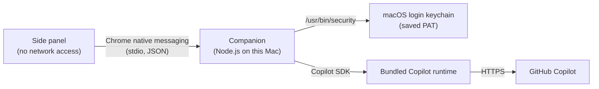

# Prompt Harbor

Prompt Harbor is an independent, unofficial Chrome side-panel client for chatting with
GitHub Copilot through the official [Copilot SDK](https://github.com/github/copilot-sdk),
which runs in a small companion process on your Mac. It is not affiliated with, sponsored
by or endorsed by GitHub.

**Current status:** the chat panel, the companion, its macOS Keychain storage for your PAT
and its installer are built and tested against a scripted fake companion. A
[live check](#live-check) with a real fine-grained PAT has also verified authentication,
model listing and multipliers, usage reporting, page access after a toolbar click,
denied page access after a cross-origin navigation, authentication failure and sign-out.

## Why a local companion

The first version called GitHub's undocumented token exchange,
`https://api.github.com/copilot_internal/v2/token`, directly from the extension. A
fine-grained PAT got **HTTP 404**. Clients that use that endpoint exchange tokens from
Copilot's editor OAuth apps. Getting past it would have meant borrowing those app IDs or
impersonating an editor, which the experiment's stop rule forbids. The direct flow is
therefore gone.

The SDK
[supports fine-grained PATs](https://github.com/github/copilot-sdk/blob/main/docs/auth/authenticate.md),
so the experiment now uses that route instead:



- The extension cannot reach the network. It has no host permissions, and its CSP sets
  `connect-src 'none'`. It can talk only to the companion.
- It reads a web page only when you tick **Include this page** for a prompt, and only in a
  tab Chrome has granted it through `activeTab`, by your clicking its toolbar icon there.
- Chrome starts the companion when the panel opens, so the panel can tell whether it is
  installed and whether a PAT is saved. With a saved PAT, the panel connects right away.
  Otherwise nothing is sent to GitHub until you choose **Connect**.
- The companion lives only as long as the panel's connection. Closing the panel ends it,
  along with its in-memory PAT and SDK session. **Sign out** deletes the saved PAT, ends the
  companion and starts a fresh one that asks for a PAT. A saved PAT stays in your login
  keychain until you sign out or uninstall the companion.

## Requirements

- macOS with Google Chrome 120 or later. The installer registers the companion with Google
  Chrome only, not with Chromium or other Chrome channels.
- Node.js 26 and pnpm 10.33.0. Install pnpm separately; the companion's TypeScript runs
  directly on the Node.js that ran the installer.
- A GitHub account with Copilot access, and permission to create a fine-grained PAT for
  it.

## Install

```sh
pnpm install --frozen-lockfile
pnpm build
pnpm companion:install
```

In Chrome, open `chrome://extensions`, turn on Developer mode, choose **Load unpacked**,
and select this checkout's `dist/` directory. The manifest's `key` pins the extension ID
to `hdmfkhdfamhcfglofebjnoepkbbbihkg`, and the companion accepts only that ID. Open the
extension from the toolbar. It should ask for a fine-grained PAT. If it shows an error
instead, the error names the fix.

`pnpm companion:install` writes two files:

- `~/Library/Application Support/prompt-harbor/companion`: a launcher that runs this
  checkout's `src/companion/main.ts` with the Node.js that ran the installer.
- `~/Library/Application Support/Google/Chrome/NativeMessagingHosts/io.github.mahata.prompt_harbor.json`:
  registers the launcher with Chrome for this extension only.

Run it again after moving this checkout or changing Node.js. To remove the companion, run
`pnpm companion:uninstall`, which also deletes any saved PAT from your login keychain,
then remove the extension in `chrome://extensions`.

Older development builds used different install and Keychain identifiers. Prompt Harbor
does not migrate or remove those entries.

## Use

- **Sign in:** the first time, the panel shows only a PAT field. Paste a fine-grained PAT
  and choose **Connect**. Once GitHub accepts it, the companion saves it in your macOS
  login keychain, and from then on the panel opens straight into the chat. **Sign out**
  deletes the saved PAT and asks for a new one.
- **Chat:** write a prompt of up to 32,768 characters and choose **Send**, or press Enter,
  ⌘ Enter or Ctrl Enter. Shift Enter starts a new line. While an input method is composing,
  such as when converting to kanji, Enter only confirms the conversion. The menu next to
  **Send** restores the model you last selected for that GitHub account when it remains
  available; otherwise, it preselects the model with the lowest billing multiplier. Each
  option ends with the multiplier the SDK reported, such as "(1×)".
- **Replies:** they stream in and render as Markdown (headings, lists, code blocks,
  tables, links), and the conversation follows them while you are scrolled to its end.
  Links open in a new tab; only `http`, `https` and `mailto` links are clickable, and
  images appear as links because the panel loads no remote content. While a reply streams, **Stop** replaces **Send**. It ends the
  reply early and keeps what arrived. You can draft the next prompt meanwhile.
- **Pages:** tick **Include this page** before sending to have Copilot read the tab you are
  viewing. The panel reads the page's title, URL, visible text and any text you selected,
  and sends them with that one prompt. The box clears after each send. Chrome lets the
  extension read a tab only after you click the toolbar icon while that tab is open, and
  only until the tab closes or navigates to a different site (origin). Pages on the same
  origin stay readable after a navigation. If the panel cannot read the tab, it sends nothing
  and says why:
  - `page_access_needed`: Chrome has not granted this tab. Click the toolbar icon on it and
    send again. `file://` pages also need **Allow access to file URLs** in
    `chrome://extensions`.
  - `page_restricted`: Chrome never allows reading `chrome://` pages, the New Tab page, the
    Chrome Web Store, other extensions or sites blocked by policy.
  - `page_error_page`: the tab shows an error page. Reload it.
  - `page_unreadable`: anything else, with Chrome's own reason when it gave one.
  - `page_timeout`: the page did not answer within 5 seconds. Up to
  100,000 characters of text and 32,768 of selection are sent, and a note tells Copilot when
  the page was cut short. The page stays in the conversation, so a few large pages can lead
  to `context_limit` sooner.
- **Conversations:** the conversation carries across prompts, including when you switch
  models. **New chat** starts over, and Copilot no longer sees the earlier messages. If a
  conversation outgrows the model's context window, a reply can fail with
  `context_limit`. Start a new chat when that happens.

## Live check

The live check has passed with a real PAT. It covers authentication, model listing and
multipliers, usage reporting, conversation behavior, page access and denial, persistence,
and sign-out. Keep it as a manual release check because the test suite never uses a real
credential or sends live Copilot requests. Never put a credential in chat, issues, commits,
screenshots, logs or CI.

1. Create a fresh, expiring
   [fine-grained PAT](https://docs.github.com/en/copilot/how-tos/copilot-cli/set-up-copilot-cli/authenticate-copilot-cli)
   with your personal account as resource owner and only the **Copilot Requests** account
   permission.
2. Paste it into the PAT field and choose **Connect**. The companion starts the SDK, which
   checks the PAT with GitHub and lists models. No prompt is sent. Once GitHub accepts the
   PAT, the panel switches to the chat, and the companion saves the PAT in your macOS
   login keychain.
3. Check that the Keychain item exists. This command prints its attributes but not the PAT:

   ```sh
   security find-generic-password -s io.github.mahata.prompt_harbor -a fine-grained-pat login.keychain
   ```

4. Send a short prompt, then a follow-up that depends on the reply. Switch models, send
   another follow-up, and check that the conversation carries over. Every prompt is a live
   request that uses your Copilot allowance, and nothing is retried automatically.
5. Choose **New chat** and check that Copilot no longer sees the earlier messages. Then ask
   for a long answer and choose **Stop** while it streams. The partial reply should stay,
   marked "Stopped. Output may be incomplete."
6. Open an ordinary web page, click the toolbar icon on it, tick **Include this page** and
   ask for a summary. The reply should reflect the page. Then follow a link on that page
   to a different site, tick the box again and send: the panel should report
   `page_access_needed` and send nothing until you click the toolbar icon again. Clicking
   the icon while the panel is open should grant access and leave the panel open.
7. Close the panel and open it again. It should open straight into the chat, connected
   with the saved PAT.
8. Record any error codes, the Chrome version, the SDK version from
   `npm ls @github/copilot-sdk`, and the model names and multipliers in the model menu.
   Check usage in your GitHub account. Do not record tokens, raw server responses or
   headers.
9. Choose **Sign out** and run the command from step 3 again. It should report that the
   item could not be found, and the panel should ask for a PAT again. Close the panel and
   revoke the PAT.

If something fails:

- **`auth_failed`:** GitHub did not accept the PAT. Check its owner, permission and
  expiry. If a correct PAT still fails, record the result and stop.
- **No enabled models:** the panel offers only models whose SDK metadata says
  `policy.state: "enabled"`, and it does not guess when that field is missing. Record the
  result and stop, because the filter may need revisiting.
- **`sdk_start_failed`:** the SDK's platform runtime may be missing. It is an optional
  dependency (`@github/copilot-sdk-darwin-arm64` or `-darwin-x64`), so run
  `pnpm install --frozen-lockfile` without `--no-optional`.
- **`keychain_read_failed`, `save_failed` or `forget_failed`:** `/usr/bin/security` could
  not read, save or delete the saved PAT. The error says what still works. Record the
  result, and delete any leftover item in Keychain Access.
- **`companion_*` codes:** the panel names the fix. Most need `pnpm companion:install`
  followed by **Try again**.

Stop when GitHub denies access. Do not work around a denial with a stored login, a `gh`
token, a classic PAT, a borrowed OAuth app ID, editor impersonation or a custom
integration ID. A passing check shows technical access through the SDK for your own
account. It does not mean approval to distribute this or to offer it to other people.

## Boundaries

The extension:

- Requests only `sidePanel`, `nativeMessaging`, `activeTab` and `scripting`. It has no host
  permissions and no content scripts. `activeTab` gives it access only to a tab where you
  clicked its toolbar icon, until that tab closes or navigates to another origin
  (same-origin navigation keeps it), and Chrome shows no
  install-time warning for it.
- Runs a script in a tab only when you send a prompt with **Include this page** ticked. The
  script runs in the tab's top frame, reads `document.title`, `location.href`, the body's
  `innerText` and the current selection, and returns them. It does not read form values,
  cookies, storage or other frames, and it changes nothing on the page. The panel gives up
  after 5 seconds and then sends nothing.
- Sends the companion a PAT only if it starts with `github_pat_`, and clears the field on
  submission. It stores only the last selected model identifier for each GitHub account in
  extension-local browser storage. The companion stores accepted PATs in the macOS login
  keychain; available models and the conversation live only in the panel's memory.
- Sends only the prompts you submit, exactly as typed, and refuses any over 32,768
  characters. It attaches page content only as described above, and never files.
- Renders prompts as plain text. Renders responses as Markdown by building DOM nodes from
  [marked](https://marked.js.org/)'s tokens, never through `innerHTML`, so raw HTML in a
  response shows as literal text. Errors show fixed text and a code,
  never the server's text or the token.

The companion:

- Exits unless its first argument is this extension's origin, which Chrome passes when this
  extension starts it. Chrome's host manifest also allows only this extension ID.
- Accepts six messages: connect with a PAT, optionally remembering it; connect with the
  saved PAT; send a prompt of at most 32,768 characters to a model from this connection's
  list, optionally with a page of at most 4,096 characters of URL, 1,000 of title, 100,000
  of text and 32,768 of selection; stop; start a new chat; and forget the saved PAT.
- Keeps a saved PAT as a generic password item in your login keychain, with service
  `io.github.mahata.prompt_harbor` and account `fine-grained-pat`:
  - It names the login keychain (`login.keychain`) in every `security` command, so a
    different default keychain or search list does not change where it saves, reads or
    deletes the PAT.
  - It saves a pasted PAT once GitHub has accepted it, replacing any earlier one. The
    panel always asks it to. A forget request that arrives before GitHub accepts the PAT
    cancels that save, so the last request wins.
  - At startup it checks only whether the item exists. It reads the PAT only to connect
    with it, and uses it only if it is still a well-formed fine-grained PAT.
  - It deletes the item on **Sign out** and on `pnpm companion:uninstall`.
  - It runs `/usr/bin/security` with only `HOME` and a system `PATH`, and stops it after
    10 seconds. The PAT goes in on standard input rather than as an argument, the tool's
    error output is discarded, and the PAT is never logged.
- Configures the SDK:
  - `mode: "empty"` and `useLoggedInUser: false`, which stop the runtime from using stored
    OAuth tokens or `gh` CLI authentication and turn off the SDK's other ambient features.
    The runtime authenticates only with the PAT the companion passes as `gitHubToken`.
  - No tools (`availableTools: []`), and every permission request is rejected.
  - One streaming session per conversation, kept across prompts and switched with
    `setModel` when you change models. **New chat** disconnects it, and the next prompt
    starts a fresh one. Infinite sessions are off, which turns off the SDK's background
    compaction and session workspace, so an overlong conversation can fail with
    `context_limit`. Sub-agent events are ignored.
- Gives the runtime a new private temporary directory as its `HOME`, `TMPDIR`, Copilot home
  (`COPILOT_HOME`) and working directory, instead of your `~/.copilot` configuration. The
  rest of its environment is a system `PATH` and the variables the SDK adds, so tokens such
  as `GH_TOKEN` are not passed on. Neither are proxy and custom CA settings such as
  `HTTPS_PROXY` or `NODE_EXTRA_CA_CERTS`, so networks that require them will not work.
- Puts an attached page ahead of your prompt, between markers, with an instruction to treat
  it as data rather than instructions.
- Enforces limits: 1 MiB per inbound message, 1 MiB per outbound message (Chrome's
  limit), 32,768 characters per prompt, 65,536 characters per reply, 60 seconds per
  connect, 5 minutes per reply, and one connect or prompt at a time. The reply length and
  time limits end a reply with an explicit error and keep what arrived.
- Counts an operation as running until it has cleaned up, and reports its error only then.
  A failed or timed-out connection waits for its runtime to stop. A reply ended by a limit
  waits for its turn to end. If the turn has not ended 5 seconds after the abort, the
  companion reports the limit, stops the runtime and exits, and the panel offers **Try
  again**.
- Handles **Stop** by aborting the current turn and keeping the partial output, marked
  incomplete. It may not prevent server-side work or charges. Stop replaces the reply's
  5-minute limit with 5 seconds: if the turn has not ended by then, the companion reports
  it stopped, stops the runtime and exits, and the panel offers **Try again**.
- Stops a runtime by asking it to shut down, killing it if it has not stopped within
  5 seconds, and then deleting its temporary directory. It does this after a failed
  connection and on exit.

Accepted risks:

- An included page goes to GitHub as part of the conversation, including its full URL.
  URLs can carry secrets such as session or reset tokens in their query strings, and the
  visible text can include private information shown on the page. Leave **Include this
  page** unticked on such pages.
- Page text can contain instructions aimed at the model (prompt injection). The companion
  tells the model to treat the page as data, but a model may still follow it and give a
  misleading answer. The session has no tools and rejects every permission request, so the
  page cannot make Copilot act on anything.

- A saved PAT is encrypted at rest in your login keychain, never in Chrome's profile. But
  macOS trusts the tool that created an item to read it without warning. The companion
  saves the PAT with `/usr/bin/security`, so any process running as your macOS user can
  read it by running that tool. Use an expiring PAT and sign out when you are done.
- The panel saves every PAT that GitHub accepts. There is no way to keep a PAT only in
  memory.
- While a PAT is saved, the panel connects with it every time it opens, which sends it to
  GitHub through the SDK.
- While connected, the PAT sits in the companion's memory and in the runtime's
  `COPILOT_SDK_AUTH_TOKEN` environment variable. Other processes running as your macOS user
  can read it there. Use a short-lived PAT and close the panel when you are done.
- Because the manifest's public `key` fixes the ID, any unpacked extension with the same key
  can talk to the companion, including connecting with the saved PAT and sending prompts.
  The companion never sends the PAT back. Loading such an extension requires access to
  your Chrome profile.
- While the companion runs, the runtime's session log in its temporary directory holds your
  prompts and replies, but not the token. If the companion is still running a few seconds
  after the panel disconnects, Chrome force-quits it, and that directory
  (`$TMPDIR/prompt-harbor-*`) can then remain. Delete leftovers by hand.
- The runtime keeps its default integration ID, `copilot-developer-cli`. The companion only
  names itself `prompt-harbor` in the SDK's `clientInfo`, which labels the runtime's
  telemetry.
- The SDK is young (1.0.x), so its options, defaults and events may change, including the
  ones this lockdown relies on. `pnpm install --frozen-lockfile` installs the exact version
  pinned in `pnpm-lock.yaml`, and `pnpm list @github/copilot-sdk` names it. After updating
  the SDK, review `src/companion/sdk-gateway.ts`, then run `pnpm check` and the live check
  again.

GitHub receives the PAT, your prompts, any pages you include and the conversation so far with the SDK's system
instructions, the chosen model, and whatever request metadata and telemetry the official
runtime sends. This project neither configures nor suppresses that telemetry.
Signing out, starting a new chat or closing the panel does not retract anything already
sent.

## Development

```sh
pnpm test
pnpm exec playwright install chromium
pnpm check
```

`pnpm check` runs the unit tests, strict TypeScript checking, a production build and the
browser tests. The browser tests:

- Use the real installer to register a scripted fake companion in a throwaway Chromium
  profile.
- Load the built extension and drive every panel state, including the first-run PAT
  prompt, a missing companion, rejected tokens, no models, saving, reusing, replacing and
  unreadable saved PATs, signing out, multi-turn chat, model switches, New chat, including
  a page (with Chrome's scripting stubbed, because a test cannot click the toolbar icon to
  grant `activeTab`) and refusing to when access is missing, keyboard
  shortcuts and input methods, the prompt length limit, following a streaming reply, Stop,
  failures, a crash mid-reply, closing the panel, permissions and layout.
- Run the real protocol code in the fake companion, which never loads the SDK and keeps
  its saved PAT in a temporary file instead of the Keychain.
- Block and record every HTTP request the browser makes, and assert that the install,
  chat, saved-PAT and permission flows make none.

No real PAT or Copilot allowance is used, so the tests do not establish live compatibility
or billing. They never touch your login keychain either. Tests that run the real
`/usr/bin/security`, directly or through the real companion or installer, give it a
temporary `HOME`, where it finds no login keychain. The other tests use fakes.

CI runs the same checks on Ubuntu for pull requests, pushes to `main`, and on demand from
the Actions tab. There, Chromium also reads the profile's `NativeMessagingHosts` directory.
Unit tests and the type-checked build run in parallel. The E2E job then tests the exact
`chrome-extension` artifact uploaded by the build, which you can also download from the
run and load unpacked in place of `dist/`. The companion still comes from
`pnpm companion:install` in a checkout of the same commit. Playwright output, including
layout screenshots, is uploaded as `playwright-test-results` even when tests fail. CI uses
no secrets and has read-only repository access.

The code is organized as:

- `src/sidepanel/`: the chat panel UI, its native messaging bridge and page capture.
- `src/companion/`: the companion's entry point, protocol state machine, SDK gateway,
  Keychain store, frame codec, page prompt and installer.
- `src/protocol/`: the messages and extension identity shared by both sides.

## Evidence

- [SDK authentication](https://github.com/github/copilot-sdk/blob/main/docs/auth/authenticate.md):
  `github_pat_` fine-grained PATs are supported, and classic `ghp_` tokens are not.
- [Copilot CLI authentication](https://docs.github.com/en/copilot/how-tos/copilot-cli/set-up-copilot-cli/authenticate-copilot-cli):
  the PAT must be owned by your personal account and have the Copilot Requests permission.
- [SDK multi-tenancy](https://github.com/github/copilot-sdk/blob/main/docs/setup/multi-tenancy.md):
  `mode: "empty"` and the default integration ID.
- [SDK streaming events](https://github.com/github/copilot-sdk/blob/main/docs/features/streaming-events.md)
  and [usage and billing](https://github.com/github/copilot-sdk/blob/main/docs/features/usage-and-billing.md):
  `assistant.message_delta`, `session.idle` and the `assistant.usage` multiplier.
- [`activeTab`](https://developer.chrome.com/docs/extensions/develop/concepts/activeTab) and
  [`chrome.scripting`](https://developer.chrome.com/docs/extensions/reference/api/scripting):
  temporary access to the tab where the user invoked the extension, kept across same-origin navigation and ended by
  navigating to another origin or closing the tab.
- [Chrome native messaging](https://developer.chrome.com/docs/extensions/develop/concepts/native-messaging)
  and [the manifest `key`](https://developer.chrome.com/docs/extensions/reference/manifest/key).
- `man security`, under `add-generic-password`: `-U` replaces an existing item, and by
  default the application that creates an item is trusted to read it without warning. The
  add, find and delete commands also take a keychain argument, and the page's examples name
  the login keychain `login.keychain`.
