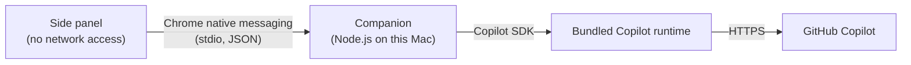

# gh-copilot-in-chrome

A private experiment: a Chrome side panel that reaches GitHub Copilot through the
official [Copilot SDK](https://github.com/github/copilot-sdk), which runs in a small
companion process on your Mac. This project is not affiliated with GitHub.

**Current status:** the side panel, the companion and its macOS installer are built and
tested against a scripted fake companion. Whether a real fine-grained PAT authenticates
through the SDK, which models it lists and how usage is billed are all **unverified** until
you run the [live check](#live-check).

## Why a local companion

The first version called GitHub's undocumented token exchange,
`https://api.github.com/copilot_internal/v2/token`, directly from the extension. A
fine-grained PAT got **HTTP 404**. Clients that use that endpoint exchange tokens from
Copilot's editor OAuth apps. Getting past it would have meant borrowing those app IDs or
impersonating an editor, which the experiment's stop rule forbids. The direct flow is
therefore gone.

The SDK
[supports fine-grained PATs](https://github.com/github/copilot-sdk/blob/main/docs/auth/authenticate.md),
so the experiment now uses that route instead:



- The extension cannot reach the network. It has no host permissions, and its CSP sets
  `connect-src 'none'`. It can talk only to the companion.
- Chrome starts the companion when the panel opens, so the panel can tell whether it is
  installed. Nothing is sent to GitHub until you choose **Connect (live)**.
- The companion lives only as long as the panel's connection. **Clear credentials and
  output** or closing the panel ends it, along with its PAT and SDK session.

## Requirements

- macOS with Google Chrome 120 or later. The installer registers the companion with Google
  Chrome only, not with Chromium or other Chrome channels.
- Node.js 22.18 or later, which runs the companion's TypeScript directly. Node.js 24 LTS is
  recommended.
- A GitHub account with Copilot access, and permission to create a fine-grained PAT for
  it.

## Install

```sh
npm ci
npm run build
npm run companion:install
```

In Chrome, open `chrome://extensions`, turn on Developer mode, choose **Load unpacked**,
and select this checkout's `dist/` directory. The manifest's `key` pins the extension ID
to `hdmfkhdfamhcfglofebjnoepkbbbihkg`, and the companion accepts only that ID. Open the
extension from the toolbar. The status line should read "Companion ready (Copilot SDK
*version*). Not connected to GitHub."

`npm run companion:install` writes two files:

- `~/Library/Application Support/gh-copilot-in-chrome/companion`: a launcher that runs this
  checkout's `src/companion/main.ts` with the Node.js that ran the installer.
- `~/Library/Application Support/Google/Chrome/NativeMessagingHosts/io.github.mahata.gh_copilot_in_chrome.json`:
  registers the launcher with Chrome for this extension only.

Run it again after moving this checkout or changing Node.js. To remove the companion, run
`npm run companion:uninstall`, then remove the extension in `chrome://extensions`.

## Live check

The live check is a separate step that you authorize yourself. Neither the test suite nor
opening the panel runs it. Never put a credential in chat, issues, commits, screenshots,
logs or CI.

1. Create a fresh, expiring
   [fine-grained PAT](https://docs.github.com/en/copilot/how-tos/copilot-cli/set-up-copilot-cli/authenticate-copilot-cli)
   with your personal account as resource owner and only the **Copilot Requests** account
   permission.
2. Paste it into **Fine-grained PAT**, check the authorization box, and choose **Connect
   (live)**. The companion starts the SDK, which checks the PAT with GitHub and lists
   models. No prompt is sent.
3. Choose one of the models the SDK reports as enabled. Each option shows the billing
   multiplier the SDK reported.
4. Check the approval box and choose **Send test prompt (live)**. The prompt is fixed:
   `Reply with exactly: Connection confirmed.` The SDK adds its own system instructions.
   Each send needs a fresh approval, and nothing is retried automatically.
5. Record the status line, any error code, the Chrome and SDK versions, the model ID and
   the "SDK usage report" line. Check usage in your GitHub account separately. Do not record
   tokens, raw server responses or headers.
6. Choose **Clear credentials and output** or close the panel, then revoke the PAT.

If something fails:

- **`auth_failed`:** GitHub did not accept the PAT. Check its owner, permission and
  expiry. If a correct PAT still fails, record the result and stop.
- **No enabled models:** the panel offers only models whose SDK metadata says
  `policy.state: "enabled"`, and it does not guess when that field is missing. Record the
  result and stop, because the filter may need revisiting.
- **`sdk_start_failed`:** the SDK's platform runtime may be missing. It is an optional
  dependency (`@github/copilot-sdk-darwin-arm64` or `-darwin-x64`), so run `npm ci` without
  `--omit=optional`.
- **`companion_*` codes:** the panel names the fix. Most need `npm run companion:install`
  followed by **Check again**.

Stop when GitHub denies access. Do not work around a denial with a stored login, a `gh`
token, a classic PAT, a borrowed OAuth app ID, editor impersonation or a custom
integration ID. A passing check shows technical access through the SDK for your own
account. It does not mean approval to distribute this or to offer it to other people.

## Boundaries

The extension:

- Requests only `sidePanel` and `nativeMessaging`. It has no host permissions, no content
  scripts and no access to pages.
- Sends the companion a PAT only if it starts with `github_pat_`, and clears the field on
  submission. It stores nothing, so credentials, models and output live only in memory.
- Renders responses as text, never as HTML. Errors show fixed text and a code, never the
  server's text or the token.

The companion:

- Exits unless its first argument is this extension's origin, which Chrome passes when this
  extension starts it. Chrome's host manifest also allows only this extension ID.
- Accepts three messages: connect with a PAT, send using a model from this connection's
  list, and stop. It never accepts prompt text, because the fixed prompt lives in the
  companion.
- Configures the SDK:
  - `mode: "empty"` and `useLoggedInUser: false`, which turn off the keychain, a stored CLI
    login and the SDK's other ambient features.
  - No tools (`availableTools: []`), and every permission request is rejected.
  - A fresh session for each send, disconnected afterwards. Sub-agent events are ignored.
- Gives the runtime a new private temporary directory as its `HOME`, `TMPDIR`, Copilot home
  (`COPILOT_HOME`) and working directory, instead of your `~/.copilot` configuration. The
  rest of its environment is a system `PATH` and the variables the SDK adds, so tokens such
  as `GH_TOKEN` are not passed on. Neither are proxy and custom CA settings such as
  `HTTPS_PROXY` or `NODE_EXTRA_CA_CERTS`, so networks that require them will not work.
- Enforces limits: 64 KiB per inbound message, 1 MiB per outbound message (Chrome's limit),
  65,536 characters of output, 60 seconds per connect or send, and one operation at a time.
  The output and time limits end a request with an explicit error and keep the partial
  output.
- Handles **Stop** by aborting the SDK session and keeping the partial output, marked
  incomplete. It may not prevent server-side work or charges.
- On exit, stops the runtime and deletes its temporary directory.

Accepted risks:

- While connected, the PAT sits in the companion's memory and in the runtime's
  `COPILOT_SDK_AUTH_TOKEN` environment variable. Other processes running as your macOS user
  can read it there. Use a short-lived PAT and clear when you are done.
- Because the manifest's public `key` fixes the ID, any unpacked extension with the same key
  can talk to the companion. Loading one requires access to your Chrome profile.
- If the companion is still running a few seconds after the panel disconnects, Chrome
  force-quits it. Its temporary directory (`$TMPDIR/gh-copilot-in-chrome-*`) can then remain,
  holding the runtime's session log with the prompt and response but not the token. Delete
  leftovers by hand.
- The runtime keeps its default integration ID, `copilot-developer-cli`. The companion only
  names itself `gh-copilot-in-chrome` in the SDK's `clientInfo`, which labels the runtime's
  telemetry.
- The SDK is young (1.0.x), so its options, defaults and events may change, including the
  ones this lockdown relies on. `npm ci` installs the exact version pinned in
  `package-lock.json`, and the status line names the running version. After updating the
  SDK, review `src/companion/sdk-gateway.ts`, then run `npm run check` and the live check
  again.

GitHub receives the PAT, the fixed prompt with the SDK's system instructions, the chosen
model, and whatever request metadata and telemetry the official runtime sends. This project
neither configures nor suppresses that telemetry. Clearing locally does not retract anything
already sent.

## Development

```sh
npm test
npx playwright install chromium
npm run check
```

`npm run check` runs the unit tests, strict TypeScript checking, a production build and the
browser tests. The browser tests:

- Use the real installer to register a scripted fake companion in a throwaway Chromium
  profile.
- Load the built extension and drive every panel state, including a missing companion,
  rejected tokens, no models, streaming, Stop, failures, a crash, Clear, closing the panel,
  permissions and layout.
- Run the real protocol code in the fake companion, which never loads the SDK.
- Block and record every HTTP request the browser makes, and assert that the install,
  connect-and-send and permission flows make none.

No real PAT or Copilot allowance is used, so the tests do not establish live compatibility
or billing. CI runs `npm run check` on Ubuntu, where Chromium also reads the profile's
`NativeMessagingHosts` directory.

The code is organized as:

- `src/sidepanel/`: the panel UI and its native messaging bridge.
- `src/companion/`: the companion's entry point, protocol state machine, SDK gateway, frame
  codec and installer.
- `src/protocol/`: the messages and extension identity shared by both sides.

## Evidence

- [SDK authentication](https://github.com/github/copilot-sdk/blob/main/docs/auth/authenticate.md):
  `github_pat_` fine-grained PATs are supported, and classic `ghp_` tokens are not.
- [Copilot CLI authentication](https://docs.github.com/en/copilot/how-tos/copilot-cli/set-up-copilot-cli/authenticate-copilot-cli):
  the PAT must be owned by your personal account and have the Copilot Requests permission.
- [SDK multi-tenancy](https://github.com/github/copilot-sdk/blob/main/docs/setup/multi-tenancy.md):
  `mode: "empty"` and the default integration ID.
- [SDK streaming events](https://github.com/github/copilot-sdk/blob/main/docs/features/streaming-events.md)
  and [usage and billing](https://github.com/github/copilot-sdk/blob/main/docs/features/usage-and-billing.md):
  `assistant.message_delta`, `session.idle` and the `assistant.usage` multiplier.
- [Chrome native messaging](https://developer.chrome.com/docs/extensions/develop/concepts/native-messaging)
  and [the manifest `key`](https://developer.chrome.com/docs/extensions/reference/manifest/key).
